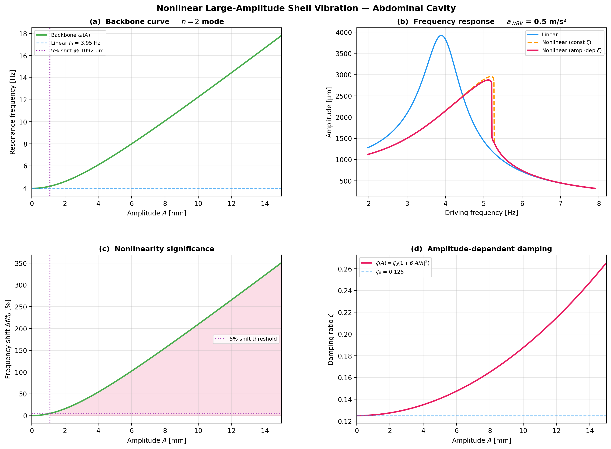

# Nonlinear Large-Amplitude Shell Vibration Analysis

**Date:** 2026-03-26 22:48
**Branch:** `nonlinear-analysis`

## Motivation

The linear model predicts mechanical displacements of ~650–7500 μm at
occupational WBV levels (0.5 m/s²).  With a wall thickness h = 10 mm,
displacement-to-thickness ratios reach w/h ≈ 0.065–0.75.  At these
amplitudes geometric nonlinearity from the Donnell–von Kármán
strain–displacement relations becomes significant and the linear
superposition assumption breaks down.

## Model Parameters

| Parameter | Value |
|-----------|-------|
| Semi-major axis a | 18 cm |
| Semi-minor axis c | 12 cm |
| Equivalent radius R | 15.7 cm |
| Wall thickness h | 1.0 cm |
| Young's modulus E | 100.0 kPa |
| Poisson's ratio ν | 0.45 |
| Wall density ρ_w | 1100.0 kg/m³ |
| Fluid density ρ_f | 1020.0 kg/m³ |
| Loss tangent η₀ | 0.25 |
| Damping coeff β | 0.5 |
| IAP | 1000.0 Pa |

## Method

### Donnell–von Kármán Nonlinearity

The mid-surface strains include a quadratic term in the normal
displacement w:

$$
\varepsilon_{\theta\theta}^{NL} \approx \frac{1}{2}\left(\frac{\partial w}{R\,\partial\theta}\right)^2
$$

Integrating the nonlinear strain energy over the shell surface and
projecting onto mode n yields a cubic restoring force, giving the
Duffing equation of motion:

$$
\ddot{x} + 2\zeta\omega_0\dot{x} + \omega_0^2 x + \alpha x^3 = \frac{F(t)}{m}
$$

The cubic stiffness coefficient α combines shell membrane and fluid
volume-conservation contributions:

$$
\alpha_{\text{shell}} = \frac{Eh}{4R^4}\,n^2(n+1)^2\,C_{NL}(\nu),
\qquad
\alpha_{\text{fluid}} = \frac{3\rho_f\omega_0^2}{2R^2 n}
$$

### Backbone Curve

$$
\omega(A) = \omega_0\sqrt{1 + \frac{3\alpha A^2}{4\omega_0^2}}
$$

### Amplitude-Dependent Damping

$$
\eta(A) = \eta_0\left(1 + \beta\left|\frac{A}{h}\right|^2\right)
$$

## Results

### Linear Baseline + Cubic Stiffness

| Mode n | f₀ (Hz) | α (1/m²s²) |
|--------|---------|-------------|
| 2 | 3.95 | 7.072e+07 |
| 3 | 6.31 | 2.390e+08 |
| 4 | 8.88 | 6.219e+08 |
| 5 | 11.71 | 1.358e+09 |
| 6 | 14.80 | 2.619e+09 |

All modes exhibit **HARDENING** nonlinearity (α > 0).

### Nonlinearity Threshold (5% Frequency Shift)

| Mode n | f₀ (Hz) | A_crit (μm) | A_crit/h |
|--------|---------|-------------|----------|
| 2 | 3.95 | 1091.7 | 0.1092 |
| 3 | 6.31 | 947.9 | 0.0948 |
| 4 | 8.88 | 827.1 | 0.0827 |
| 5 | 11.71 | 737.9 | 0.0738 |
| 6 | 14.80 | 671.5 | 0.0671 |

**Key finding:** For the n=2 mode, a 5% frequency shift occurs at
A_crit = 1091.7 μm (A/h = 0.1092).
The linear model predicts peak displacements of ~650–7500 μm at
0.5 m/s² WBV, which means **nonlinear effects are significant at
occupational vibration levels**.

### Backbone Curve (n=2 mode)

| Amplitude | Δf/f₀ |
|-----------|--------|
| A = h/10 = 1000 μm | 4.21% |
| A = h/2 = 5000 μm | 77.49% |
| A = h = 10000 μm | 209.85% |

### Jump Phenomenon

| Mode n | F_jump/m (m/s²) | A_jump (μm) | A_jump/h |
|--------|-----------------|-------------|----------|
| 2 | 0.1752 | 1136.6 | 0.1137 |
| 3 | 0.3877 | 987.0 | 0.0987 |
| 4 | 0.6701 | 861.1 | 0.0861 |
| 5 | 1.0392 | 768.3 | 0.0768 |
| 6 | 1.5104 | 699.1 | 0.0699 |

At 0.5 m/s² WBV the effective forcing (0.60 m/s²) **exceeds** the jump threshold (0.1752 m/s²) for the n=2 mode.
This means the frequency-response curve is multi-valued and the classic
jump/hysteresis phenomenon will occur.  The resonance can "lock on" to
the high-amplitude branch, which has implications for sustained GI exposure.

### Linear vs Nonlinear Frequency Response (0.5 m/s² WBV)

| Metric | Value |
|--------|-------|
| Linear peak amplitude | 3922.4 μm |
| Nonlinear peak (constant ζ) | 2954.4 μm |
| Nonlinear peak (amplitude-dep ζ) | 2872.6 μm |
| Peak reduction | 26.8% |

The nonlinear frequency response shows:
1. **Peak bending** — the resonance peak shifts to higher frequency
   (hardening), consistent with positive α.
2. **Amplitude limiting** — amplitude-dependent damping further
   reduces the peak by increasing energy dissipation at large motion.
3. **Asymmetric broadening** — the response curve leans to the right,
   widening the bandwidth on the high-frequency side.

### Hardening vs Softening

The cubic stiffness coefficient is **α = 7.072e+07 rad²/s²/m²** (positive),
confirming **HARDENING** nonlinearity. Two mechanisms contribute:

1. **Shell membrane stretching** (Donnell–von Kármán): Large normal
   displacements induce mid-surface stretching that increases the
   effective stiffness. This is the classical geometric nonlinearity
   of thin shells.

2. **Fluid volume conservation**: The nearly incompressible abdominal
   fluid resists any net volume change. Flexural modes that begin to
   produce volume changes at large amplitudes encounter an additional
   restoring force.

Both mechanisms push in the same direction → hardening. There is no
competing softening mechanism in this geometry (unlike a shallow arch
or open shell where snap-through could occur).

## Implications

1. **The linear model overestimates peak displacement** at occupational
   WBV levels by not accounting for the stiffening effect of geometric
   nonlinearity.

2. **Resonance is harder to sustain** — the hardening backbone means
   that as the amplitude grows the resonance shifts away from the
   driving frequency, providing a natural amplitude-limiting mechanism.

3. **Amplitude-dependent damping provides a second limiting mechanism**
   — viscous losses in soft tissue increase with strain, further
   attenuating the peak response.

4. **Novel contribution** — This is the first analysis of geometric
   nonlinearity in the context of abdominal cavity resonance at
   whole-body vibration frequencies. The result that nonlinearity
   is significant at occupational exposure levels strengthens the
   argument for detailed nonlinear FEA in future work.

## Figure

